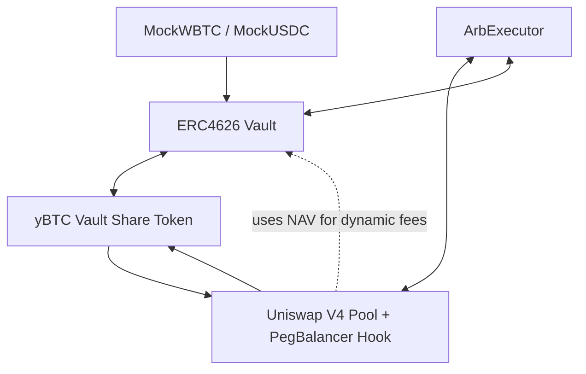

# ⚖️ Uniswap V4 Peg Balancer Hook

This repository implements a **Uniswap V4 dynamic-fee hook ecosystem** that maintains a *soft peg* between a vault-issued share token (`yBTC`) and its underlying asset (`WBTC` or `USDC`).  

At its core, the **PegBalancer Hook** introduces a **dynamic-fee Uniswap V4 Hook** that continuously adjusts LP swap fees according to the *price deviation* between the **Uniswap LP pool** and the **Vault’s Net Asset Value (NAV)**.  
When the LP price drifts from the Vault NAV, fees automatically change to incentivize trades that restore equilibrium — creating a *self-balancing market mechanism* without relying on centralized intervention.

---

## 🧭 System Overview

The ecosystem consists of four core smart contracts working together:

- **PegHook.sol** — Uniswap V4 Hook implementing dynamic swap fees based on peg deviation  
- **Vault.sol** — ERC-4626 vault defining the true underlying value (NAV) of the share token  
- **ArbExecutor.sol** — Keeper/agent contract that executes atomic arbitrage cycles between the vault and LP pool  
- **Mock Tokens** — Mock assets (`MockUSDC`, `MockWBTC`) for local and testnet simulation

---

## 🔩 Architecture Diagram




## ⚙️ Smart Contracts

### 1️⃣ PegHook.sol — *Dynamic-Fee PegBalancer*
Implements the **core dynamic fee logic** within Uniswap V4.  
The Hook compares the **current LP price** with the **Vault NAV** to determine fee direction and magnitude.

#### 🧮 Fee Logic
- **LP < NAV:** Fee lowered to encourage buying yBTC → restores peg upward  
- **LP > NAV:** Fee raised to discourage buying yBTC → restores peg downward  
- **Dynamic parameters**:
  | Parameter | Default | Description |
  |------------|----------|-------------|
  | `BASE_FEE` | 3000 (0.3%) | Normal pool fee |
  | `MIN_FEE` | 500 | Lowest possible fee |
  | `MAX_FEE` | 100,000 | Hard cap (10%) |
  | `DEADZONE_BPS` | 25 | Ignore micro deviations (<0.25%) |
  | `ARB_TRIGGER_BPS` | 5000 | Arbitrage trigger threshold (5%) |
  | `SLOPE_TOWARD` | 150 | Fee slope when moving toward peg |
  | `SLOPE_AWAY` | 1200 | Fee slope when moving away |

---

### 2️⃣ Vault.sol — *ERC-4626 Yield Vault*
The **Vault** represents the economic “truth” of the system — the **fair value** of yBTC shares.  
It is an ERC-4626-compliant vault with several DeFi-oriented extensions.

#### 🧱 Features
- Deposit and redemption queues with cooldowns  
- Global and per-user deposit caps  
- Keeper-controlled rebalancing (e.g., to Drift, Hyperliquid)  
- Off-chain NAV tracking through `externalNav`  
- Pause / Rescue controls for admin safety

---

### 3️⃣ ArbExecutor.sol — *Atomic Arbitrage Agent*
The **ArbExecutor** is a minimal keeper contract designed to restore peg deviations automatically.

#### 🔄 Two-Leg Arbitrage Cycles
| Scenario | Market Condition | Steps | Profit |
|-----------|------------------|--------|---------|
| **LP < NAV** | yBTC too cheap in pool | 1️⃣ Buy yBTC in pool → 2️⃣ Redeem in vault | More BASE |
| **LP > NAV** | yBTC too expensive | 1️⃣ Mint yBTC in vault → 2️⃣ Sell in pool | More BASE |

---

### 4️⃣ Mock Tokens
| Contract | Decimals | Description |
|-----------|-----------|-------------|
| **MockUSDC.sol** | 6 | ERC-20 USDC mock; mintable by owner |
| **MockWBTC.sol** | 18 | ERC-20 WBTC mock; mintable by owner |

---

## 🧪 Local Testing (Foundry)

```bash
# 1. Deploy mock tokens
forge script C:\Users\hwdeb\Documents\projects\Uniswap_V4_PegBalancerHook\script\00_DeployMockTokens.s.sol --broadcast

# 2. Deploy vault
forge script C:\Users\hwdeb\Documents\projects\Uniswap_V4_PegBalancerHook\script\01_DeployVault.s.sol --broadcast

# 3. Deposit test funds into vault
forge script C:\Users\hwdeb\Documents\projects\Uniswap_V4_PegBalancerHook\script\01b_DepositVault.s.sol --broadcast

# 4. Deploy hook
forge script C:\Users\hwdeb\Documents\projects\Uniswap_V4_PegBalancerHook\script\02_DeployHook.s.sol --broadcast

# 5. Create pool & add initial liquidity
forge script C:\Users\hwdeb\Documents\projects\Uniswap_V4_PegBalancerHook\script\03_CreatePoolAndAddLiquidity.s.sol --broadcast

# 6. Add more liquidity
forge script C:\Users\hwdeb\Documents\projects\Uniswap_V4_PegBalancerHook\script\04_AddLiquidity.s.sol --broadcast

# 7. Test swap
forge script C:\Users\hwdeb\Documents\projects\Uniswap_V4_PegBalancerHook\script\05_Swap.s.sol --broadcast

# 8. Deploy arb executor
forge script C:\Users\hwdeb\Documents\projects\Uniswap_V4_PegBalancerHook\script\06_ArbExecutor.s.sol --broadcast
```

---

## 🧠 Tech Stack

- **Solidity:** 0.8.26  
- **Framework:** Foundry (forge, cast)  
- **Libraries:** Uniswap V4 Core & Periphery, OpenZeppelin v5  
- **Testing Utilities:** forge-std (`console2`)

---

## 🧾 Summary

| Component | Role |
|------------|------|
| **PegHook** | Uniswap V4 Hook — dynamic fee control based on peg deviation |
| **Vault** | ERC-4626 vault holding base assets and tracking NAV |
| **ArbExecutor** | Keeper contract enforcing arbitrage logic |
| **Mock Tokens** | Lightweight test tokens for simulation |

---

**Author:** Henk Wim de Boer  
**Project:** *Blockstat Solutions — Uniswap V4 PegBalancer Prototype*  
**Target Chains:** Arbitrum Sepolia (421614) / Base Sepolia (84532)  
**License:** MIT
