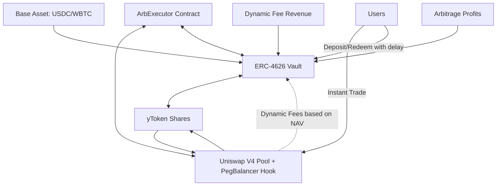

# ⚖️ PegBalancerHook: Liquid Markets for Yield Tokens

> **Transforming illiquid ERC-4626 vault shares into freely tradable assets through Uniswap V4 with dynamic fees**

A next-generation DeFi protocol that solves the liquidity problem of yield-bearing tokens by creating a self-balancing secondary market with dual-peg mechanisms and sustainable yield enhancement.

[](https://opensource.org/licenses/MIT)
[](https://soliditylang.org/)
[](https://uniswap.org/)

---

## 🎯 The Problem

Traditional ERC-4626 vaults issue yield tokens (e.g., **yBTC**, **yUSDC**) representing deposits in yield-generating strategies. However, these tokens face a critical **liquidity problem**:

❌ **Redemption Delays:** 24-48 hours (or longer) withdrawal periods  
❌ **Locked During Volatility:** Users can't exit during market crashes  
❌ **No Price Discovery:** Limited secondary markets  
❌ **Capital Inefficiency:** Funds locked even for small withdrawals

**Example:** A user deposits BTC into a vault earning 8% APY. They receive yBTC shares but must wait 48 hours to redeem. If BTC crashes 20% during this period, they're completely locked in.

---

## 💡 Our Solution

**PegBalancerHook creates a liquid secondary market** for vault shares through Uniswap V4, enabling instant trading while maintaining price stability through:

### 1. 🎨 **Soft Peg (Dynamic Fees)**

- Uniswap V4 pool with custom hook adjusts fees based on LP price vs Vault NAV
- **Toward peg:** Lower fees (0.05%) → Encourage rebalancing trades
- **Away from peg:** Higher fees (up to 10%) → Deter harmful trades, reward LPs

### 2. 🔒 **Hard Peg (Arbitrage Executor)**

- Smart contract enforces parity when deviation exceeds threshold (e.g., 5%)
- Atomic arbitrage between pool and vault restores balance
- Captures profit for the protocol

### 3. 💰 **Sustainable Yield Enhancement**

- Higher dynamic fees during volatility flow to LPs
- Arbitrage profits accumulate for the protocol
- Creates additional revenue streams beyond base vault yield

---

## 🏗️ Architecture



### System Components

| Component           | Role                                  | Purpose                                            |
| ------------------- | ------------------------------------- | -------------------------------------------------- |
| **Vault.sol**       | ERC-4626 vault with redemption delays | Defines true NAV and generates base yield          |
| **PegHook.sol**     | Uniswap V4 dynamic fee hook           | Soft peg: adjusts fees to maintain price stability |
| **ArbExecutor.sol** | On-chain arbitrage contract           | Hard peg: enforces parity through atomic trades    |
| **PegFeeMath.sol**  | Fee calculation library               | Computes deviation-based dynamic fee curves        |

---

## ⚙️ How It Works

### User Flow Example

```
Traditional Vault:
1. User deposits 100 USDC → receives 100 yUSDC
2. Market crashes, user wants to exit
3. ❌ Must wait 48 hours for redemption
4. ❌ Loses 15% during wait period

With PegBalancerHook:
1. User deposits 100 USDC → receives 100 yUSDC
2. Market crashes, user wants to exit
3. ✅ Instantly sells yUSDC in Uniswap V4 pool
4. ✅ Exits immediately, pays only 0.3% fee
```

### Arbitrage Flow

**Scenario 1: LP Price < Vault NAV** (e.g., 0.95 vs 1.00)

```
1. ArbExecutor buys 100 yUSDC from pool for 95 USDC
2. Queues withdrawal in vault
3. Receives 100 USDC after redemption
4. Profit: 5 USDC (5.26% gain)
```

**Scenario 2: LP Price > Vault NAV** (e.g., 1.05 vs 1.00)

```
1. ArbExecutor mints 100 yUSDC in vault for 100 USDC
2. Sells 100 yUSDC in pool for 105 USDC
3. Profit: 5 USDC (5% gain)
```

---

## 🎛️ Dynamic Fee Mechanism

### Fee Parameters

| Parameter         | Default       | Description                                         |
| ----------------- | ------------- | --------------------------------------------------- |
| `BASE_FEE`        | 3000 (0.30%)  | Normal pool fee within deadzone                     |
| `MIN_FEE`         | 500 (0.05%)   | Minimum fee for peg-restoring trades                |
| `MAX_FEE`         | 100,000 (10%) | Maximum fee for peg-worsening trades                |
| `DEADZONE_BPS`    | 25 (0.25%)    | No fee adjustment within this range                 |
| `SLOPE_TOWARD`    | 150           | Fee reduction: -0.015% per 1% deviation toward peg  |
| `SLOPE_AWAY`      | 1200          | Fee increase: +0.12% per 1% deviation away from peg |
| `ARB_TRIGGER_BPS` | 5000 (50%)    | Extreme deviation triggers min/max fees             |

### Fee Examples

| Deviation | Direction     | Fee Applied | Reasoning                         |
| --------- | ------------- | ----------- | --------------------------------- |
| 0.2%      | Either        | 0.30%       | Within deadzone                   |
| 5%        | Toward peg    | 0.23%       | Reduced to encourage rebalancing  |
| 5%        | Away from peg | 6.30%       | Increased to deter harmful trades |
| 20%       | Toward peg    | 0.05%       | Minimum fee (strong incentive)    |
| 20%       | Away from peg | 10.00%      | Maximum fee (strong deterrent)    |

### Why Asymmetric Slopes?

**Slope Away (1200) >> Slope Toward (150)**

- 8x stronger penalty for harmful trades
- Heavy disincentive for moving away from peg
- Light incentive for restoring peg (combined with lower base fee)
- Result: Natural gravitation toward parity

---

## 💰 Yield Enhancement

### Revenue Streams

1. **Base Vault Yield:** Traditional DeFi yields (e.g., 8% APY from lending)
2. **Dynamic Fee Revenue:** Higher fees during volatility/deviation
3. **Arbitrage Profits:** Captured when restoring peg
4. **LP Fees:** Standard AMM fees for providing liquidity

### Distribution Model

```
Total Protocol Revenue:
├─ 60% → Liquidity Providers (LP rewards)
├─ 30% → Vault (boosts base APY)
└─ 10% → Protocol Treasury

Result: Higher effective yields for all participants
```

### Example Scenario

**Traditional Vault:** 8% APY  
**With PegBalancerHook:**

- Base yield: 8% APY
- Dynamic fee revenue: +1.5% APY
- Arbitrage profits: +0.8% APY
- **Total: 10.3% APY** (+2.3% enhancement)

---

## ⚙️ Smart Contracts

### 1️⃣ PegHook.sol — _Dynamic-Fee PegBalancer_

Implements the **core dynamic fee logic** within Uniswap V4.  
The Hook compares the **current LP price** with the **Vault NAV** to determine fee direction and magnitude.

#### 🧮 Fee Logic

- **LP < NAV:** Fee lowered to encourage buying yBTC → restores peg upward
- **LP > NAV:** Fee raised to discourage buying yBTC → restores peg downward
- **Dynamic parameters**:
  | Parameter | Default | Description |
  |------------|----------|-------------|
  | `BASE_FEE` | 3000 (0.3%) | Normal pool fee |
  | `MIN_FEE` | 500 | Lowest possible fee |
  | `MAX_FEE` | 100,000 | Hard cap (10%) |
  | `DEADZONE_BPS` | 25 | Ignore micro deviations (<0.25%) |
  | `ARB_TRIGGER_BPS` | 5000 | Arbitrage trigger threshold (5%) |
  | `SLOPE_TOWARD` | 150 | Fee slope when moving toward peg |
  | `SLOPE_AWAY` | 1200 | Fee slope when moving away |

---

### 2️⃣ Vault.sol — _ERC-4626 Yield Vault_

The **Vault** represents the economic “truth” of the system — the **fair value** of yBTC shares.  
It is an ERC-4626-compliant vault with several DeFi-oriented extensions.

#### 🧱 Features

- Deposit and redemption queues with cooldowns
- Global and per-user deposit caps
- Keeper-controlled rebalancing (e.g., to Drift, Hyperliquid)
- Off-chain NAV tracking through `externalNav`
- Pause / Rescue controls for admin safety

---

### 3️⃣ ArbExecutor.sol — _Atomic Arbitrage Agent_

The **ArbExecutor** is a minimal keeper contract designed to restore peg deviations automatically.

#### 🔄 Two-Leg Arbitrage Cycles

| Scenario     | Market Condition       | Steps                                    | Profit    |
| ------------ | ---------------------- | ---------------------------------------- | --------- |
| **LP < NAV** | yBTC too cheap in pool | 1️⃣ Buy yBTC in pool → 2️⃣ Redeem in vault | More BASE |
| **LP > NAV** | yBTC too expensive     | 1️⃣ Mint yBTC in vault → 2️⃣ Sell in pool  | More BASE |

---

### 4️⃣ PegFeeMath.sol

The **PegFeeMath** contains the formulas to calculate the dynamic fees

````

---

## 🚀 Deployment

### Local Testing (Foundry)

```bash
# 1. Install dependencies
forge install

# 2. Deploy mock tokens
forge script script/00_DeployMockTokens.s.sol --broadcast --rpc-url local

# 3. Deploy vault
forge script script/01_DeployVault.s.sol --broadcast --rpc-url local

# 4. Initialize vault with deposits
forge script script/01b_DepositVault.s.sol --broadcast --rpc-url local

# 5. Deploy PegBalancer hook
forge script script/02_DeployHook.s.sol --broadcast --rpc-url local

# 6. Create Uniswap V4 pool with hook
forge script script/03_CreatePoolAndAddLiquidity.s.sol --broadcast --rpc-url local

# 7. Add liquidity
forge script script/04_AddLiquidity.s.sol --broadcast --rpc-url local

# 8. Test swap (triggers dynamic fees)
forge script script/05_Swap.s.sol --broadcast --rpc-url local

# 9. Deploy arbitrage executor
forge script script/06_ArbExecutor.s.sol --broadcast --rpc-url local
````

### Testnet Deployment

```bash
# Arbitrum Sepolia
forge script script/00_DeployMockTokens.s.sol \
  --broadcast \
  --rpc-url arbitrum_sepolia \
  --verify \
  --etherscan-api-key $ARBISCAN_API_KEY

# Base Sepolia
forge script script/00_DeployMockTokens.s.sol \
  --broadcast \
  --rpc-url base_sepolia \
  --verify \
  --etherscan-api-key $BASESCAN_API_KEY
```

---

## 🤖 Automated Arbitrage Bot

A Node.js bot monitors price deviations and executes arbitrage automatically.

### Setup

```bash
cd backend
npm install

# Configure environment
cp .env.example .env
# Edit .env with your settings
```

### Configuration

```bash
# .env
NEXT_PUBLIC_ALCHEMY_API_KEY_FULL=https://arb-sepolia.g.alchemy.com/v2/YOUR_KEY
NEXT_PUBLIC_PRIVATE_KEY=0x...
NEXT_PUBLIC_ARB_EXECUTOR=0x...
NEXT_PUBLIC_VAULT_ADDRESS=0x...
ARB_TRIGGER_BPS=500  # 5% deviation triggers arbitrage
```

### Run Bot

```bash
node server.js
```

**Bot Features:**

- WebSocket monitoring of pool swaps
- Real-time NAV tracking
- Automatic arbitrage execution at threshold
- Profit/loss tracking
- Transaction logging

See [Backend README](./backend/README.md) for detailed documentation.

---

## 📊 Key Benefits

### For Users

✅ **Instant Liquidity** - Exit positions anytime without waiting  
✅ **Fair Pricing** - Dynamic fees maintain price near NAV  
✅ **Capital Efficiency** - No need to wait for redemption delays  
✅ **Market Access** - Trade yield tokens like any other asset

### For Liquidity Providers

✅ **Higher Yields** - Earn enhanced fees during volatility  
✅ **Lower IL Risk** - Soft peg mechanism reduces impermanent loss  
✅ **Sustainable Revenue** - Multiple income streams  
✅ **Arbitrage Protection** - Higher fees deter harmful trades

### For DeFi Protocols

✅ **Additional Revenue** - Capture arbitrage profits and higher fees  
✅ **Enhanced APY** - Boost vault yields with trading revenue  
✅ **User Retention** - Better UX keeps users engaged  
✅ **Composability** - Fully compatible with existing DeFi ecosystem

---

## 🧪 Testing

### Run Tests

```bash
# All tests
forge test

# Specific test file
forge test --match-path test/PegHook.t.sol

# With gas report
forge test --gas-report

# With verbose output
forge test -vvv
```

### Test Coverage

```bash
forge coverage
```

### Key Test Cases

- ✅ Dynamic fee calculation at various deviations
- ✅ Arbitrage execution (both directions)
- ✅ Edge cases (zero liquidity, extreme deviation)
- ✅ Access control and safety mechanisms
- ✅ Integration tests (full arbitrage cycles)

---

## 🔐 Security Considerations

### Audited Components

- ✅ ERC-4626 standard implementation
- ✅ Uniswap V4 hook interfaces
- ✅ OpenZeppelin security libraries

### Safety Mechanisms

- ⚠️ Owner-only arbitrage executor
- ⚠️ Pausable vault and hook
- ⚠️ Slippage protection on swaps
- ⚠️ Deadline enforcement
- ⚠️ Min/max fee bounds
- ⚠️ Reentrancy guards

### Risks

- Smart contract risk (audit recommended before mainnet)
- Oracle manipulation risk (consider TWAP for production)
- Keeper centralization (consider decentralized keeper network)

---

## 🛣️ Roadmap

### Phase 1: MVP ✅

- [x] Dynamic fee hook implementation
- [x] ERC-4626 vault with redemption queue
- [x] Basic arbitrage executor
- [x] Testnet deployment

### Phase 2: Enhancement 🚧

- [ ] TWAP-based price deviation (manipulation resistance)
- [ ] Multi-oracle support (Chainlink, Pyth)
- [ ] Decentralized keeper network
- [ ] Governance for parameter adjustment

### Phase 3: Scale 📈

- [ ] Multiple vault integrations
- [ ] Cross-chain deployment
- [ ] Advanced analytics dashboard
- [ ] Professional audit

---

## 📚 Documentation

- PM

---

## 📧 Contact

**Henk Wim de Boer**

- Email: hwdeboer@gmail.com

---

## 📜 License

MIT License © 2025

---

## 🙏 Acknowledgments

- Uniswap V4 team for the extensible hook framework
- OpenZeppelin for battle-tested security libraries
- ERC-4626 standard authors for the vault interface
- Foundry team for the excellent development tools

---

**Built with ❤️ to make DeFi more liquid and efficient**
